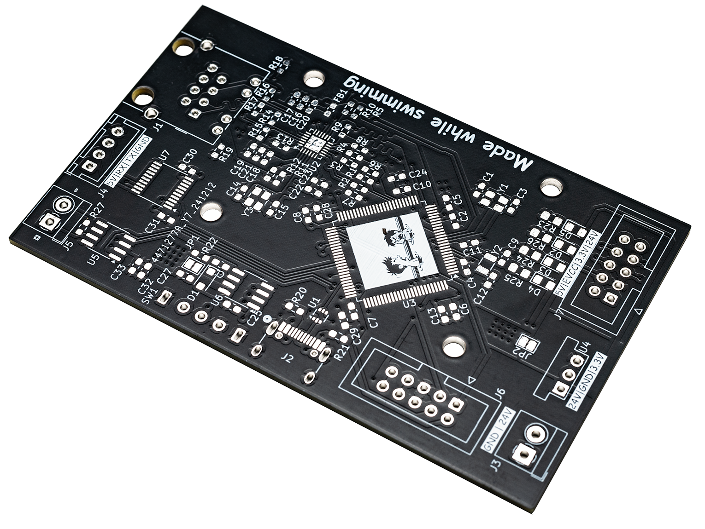
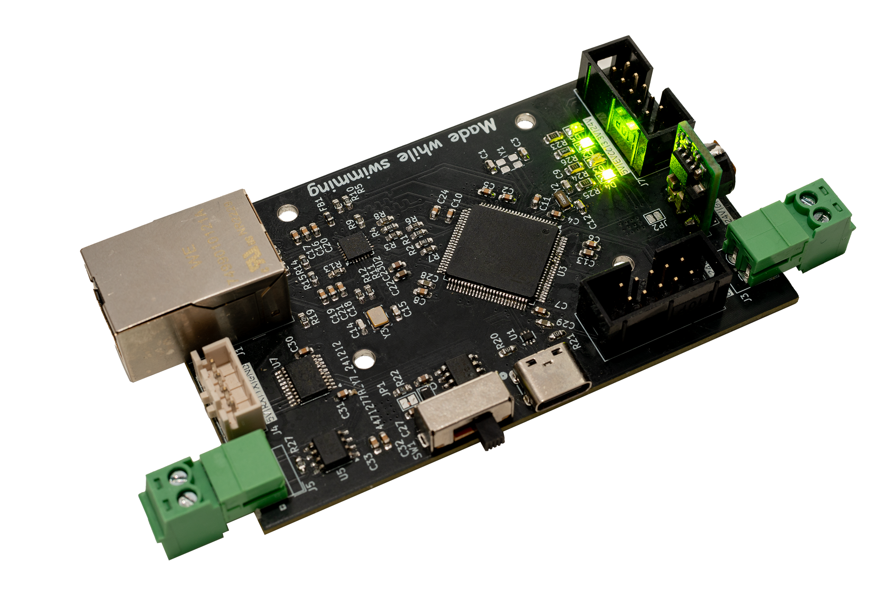

# Smart Car Charging Station: Building a Smarter EV Charging Network

## introduction

The Smart Car Charging Station (SCCS) is a custom-engineered PCB integrated with an EVCC-01 module, designed to streamline communication between electric vehicle charging systems and home automation networks. This project, completed at [PXL University of Applied Sciences and Arts](https://www.pxl.be/), creates a scalable, interconnected network of charging stations, enabling efficient energy use and seamless integration into smart home ecosystems.

## Key Features and Goals
### Communication

The SCCS supports multiple communication protocols:
 - **Ethernet**: For high-speed data transfer and scalability.
 - **CAN Bus**: For reliable vehicle communication.
 - **KNX**: To integrate with home automation systems.
 - **UART**: Direct connection with the EVCC-01 module.

### Objectives

 1. Compact design with long-term reliability (20+ years).
 2. Scalability for multiple units in a single network.
 3. Power-efficient operation with sleep modes.

## Hardware Design
### Component Choices

The core of the design is the **STM32F217VG** microcontroller, chosen for its native support for Ethernet, CAN, and UART, as well as its long-term reliability. The PCB includes:

 - A 4-layer design for optimal power distribution.
 - Robust protection mechanisms like ESD diodes and Schottky diodes.
 - A modular design to simplify future upgrades, provided by the expansion header.


  
  


### Challenges

 - **Signal Integrity**: Achieved through impedance-matched traces and serpentine routing.
 - **Scalability**: Each module is uniquely identified by its STM32 ID for seamless network integration.
 - **Fabrication**: Designed for hand assembly, allowing prototyping and patchwork.

## Software Overview

The SCCS software uses RTOS for real-time processing and prioritization. Key features include:

 - **Error Monitoring**: Tracks abnormal conditions like over-temperature or voltage.
 - **Command Handling**: Allows dynamic configuration and data queries.
 - **Scalable Networking**: Supports adding new stations with minimal setup.

## Results and Future Work
### Achievements

 - Working UART communication with the EVCC-01.
 - Promising initial tests for CAN Bus communication.
 - Functional PCB assembly and testing.

### Lessons Learned

 - The STM32F217VG provided a robust foundation, though alternative chips with USB programming would simplify development.
 - KNX integration remains a future goal due to its lack of documentation.

### Future Goals

 - Finalize KNX protocol implementation.
 - Optimize network scalability for larger installations.
 - Explore additional features like solar panel integration.

## Conclusion

This project successfully demonstrates the feasibility of a scalable, efficient EV charging network. The SCCS provides a solid foundation for integrating EV charging with smart home systems, enhancing energy efficiency and user convenience. Continued development could further optimize its capabilities, ensuring it remains a versatile and future-proof solution.

This project was completed by

 - Seppe Budennaers
 - Lucas Cosemans
 - Kobe Dieryck
 - Dries Nuttin
 
under the guidance of:

 - Jan Clerinx
 - Martijn Leemans
 - Ward Martens.