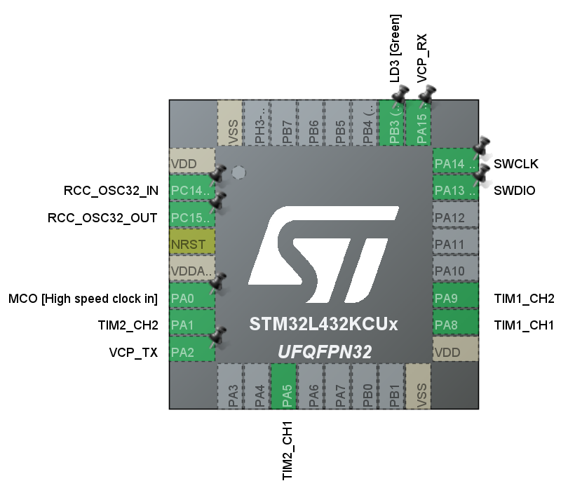




## Videos 

<!-- sqs:beyondspace-youtube-embed-code -->            
<iframe src="https://www.youtube.com/embed/rqUkOZ4YkJQ?autoplay=1&loop=1&playlist=rqUkOZ4YkJQ&mute=1&playsinline=1&iv_load_policy=3&controls=0" width="315" height="560" frameborder="0" allowfullscreen style="max-width: 100%;"></iframe>
<!-- /sqs:beyondspace-youtube-embed-code -->

<!-- sqs:beyondspace-youtube-embed-code -->            
<iframe src="https://www.youtube.com/embed/FPUD-hsDkuE?autoplay=1&loop=1&playlist=FPUD-hsDkuE&mute=1&modestbranding=1&playsinline=1&iv_load_policy=3&controls=0&disablekb=1&fs=0&color=white" width="315" height="560" frameborder="0" allowfullscreen style="max-width: 100%;"></iframe>
<!-- /sqs:beyondspace-youtube-embed-code -->


# DC Brushed PID Servo with STM32

This is a demonstration project using an STM32 Nucleo board to build a closed-loop DC brushed servo system using PWM and quadrature encoder feedback.

One of the timers is configured in **quadrature encoder mode**, while another timer handles **PWM output using two compare channels** to control direction.

This is the `.ioc` setup:



The encoder signals A and B are connected to a timer running in encoder mode. This counts up or down depending on the rotation direction. The counter value gives us the current position.

Every PID loop iteration, the counter is read and adjusted for overflows and underflows, and then fed into the PID library to compute a new output.

## PID Setup

The PID loop is configured as follows:

```c
// init the pid
PID(&TPID, &EncoderPosition, &PIDOut, &TargetPosition, 1500, 0, 9,  _PID_P_ON_E, _PID_CD_DIRECT);
// set mode
PID_SetMode(&TPID, _PID_MODE_AUTOMATIC);
// set sample time in ms
PID_SetSampleTime(&TPID, 1);
// set output limits
PID_SetOutputLimits(&TPID, -32767, 32767);
```
The output of the PID is used to control two PWM channels. Depending on the sign of the output, one of the channels is driven to generate forward or reverse torque.

## Main Control Loop

Below is a simple snippet of the main loop that performs this logic and steps the motor forward by 590 encoder counts every second:

```c
while (1)
{
	PID_Compute(&TPID);
	if(PIDOut > 0){
		__HAL_TIM_SET_COMPARE(&htim2, TIM_CHANNEL_1, PIDOut);
		__HAL_TIM_SET_COMPARE(&htim2, TIM_CHANNEL_2, 0);
	}else if (PIDOut < 0){
		__HAL_TIM_SET_COMPARE(&htim2, TIM_CHANNEL_1, 0);
		__HAL_TIM_SET_COMPARE(&htim2, TIM_CHANNEL_2, -PIDOut);
	}else{
		__HAL_TIM_SET_COMPARE(&htim2, TIM_CHANNEL_1, 0);
		__HAL_TIM_SET_COMPARE(&htim2, TIM_CHANNEL_2, 0);
	}
	time = HAL_GetTick();
	if (time - previous_time >= 1000) {
		previous_time = time;
		TargetPosition += 590;
	}
	HAL_Delay(1);
}
```
This snippet is from [main.c](https://raw.githubusercontent.com/TheNeg0t1ator/DC-Brushed-Servo/refs/heads/master/EncoderTest/Core/Src/main.c)
## How PID Works

A PID controller continuously adjusts the output to reduce the error between a measured value (in this case, motor position) and a desired setpoint.

 - **P** (Proportional): reacts to the current error.
 - **I** (Integral): accumulates past errors.
 - **D** (Derivative): dampens the response based on rate of change.
This system only uses P and D, with a very small or zero integral term, to reduce overshoot and oscillations.

The output is a signed value used to drive the PWM signal in forward or reverse mode.

## STM32 Encoder Timer

The encoder timer mode uses two input channels (TI1 and TI2) connected to the encoder’s A and B outputs. Internally, STM32 counts based on the phase difference between the signals:

 - `Clockwise rotation = count up.`
 - `Counter-clockwise = count down.`

This timer runs entirely in hardware. No interrupts or GPIO reads are needed, and the encoder position can be read from `__HAL_TIM_GET_COUNTER()` at any time.

Overflow and underflow are handled by tracking changes and correcting the total position manually, extending the 16-bit counter to a virtual 32-bit counter in software.

This is extremely efficient, requiring no ISR overhead, and ideal for embedded control loops.

